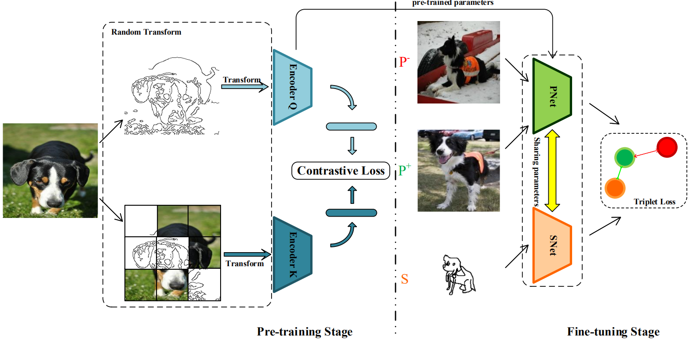

# Self-SBIR
The official code base for Boosting Fine-grained Sketch-based Image Retrieval with Self-supervised Learning

We give the test script and the pkl file of the dataset ChairV2 extracted by our full model here. The full code will be released soon.
